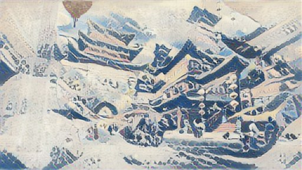

# Neural Style Transfer

Welcome to the Neural Style Transfer project! This repository implements the Neural Style Transfer (NST) algorithm, enabling you to blend the content of one image with the artistic style of another to create visually stunning results. As a highlight, this project includes a **Telegram bot** that lets you interact with the NST algorithm directly from **Telegram**, making it easy to generate stylized images on the go! It’s perfect for anyone interested in deep learning, computer vision, generative art, or building interactive bots.

Check out my step-by-step guide on **creating a Telegram bot** in my Medium blog post: 
[Create a Telegram Bot Using BotFather and Enhance It with Python](https://medium.com/@shudharshan07/create-a-telegram-bot-using-botfather-and-enhance-it-with-python-eb8690cf989c)

I followed the documentation released by tensorFlow : [Documentation](https://www.tensorflow.org/tutorials/generative/style_transfer)

## Table of Contents
- [About](#about)
- [Features](#features)
- [Installation](#installation)
- [Examples](#examples)
- [Requirements](#requirements)
- [Contributing](#contributing)

## About
Neural Style Transfer (NST) is a technique that uses convolutional neural networks (CNNs) to transfer the artistic style of one image (e.g., a painting) onto the content of another image (e.g., a photograph). This project implements NST using Python and popular deep learning frameworks, enabling users to create unique, stylized images.

The algorithm is based on the seminal work by Gatys et al. (2015), leveraging pre-trained CNNs like VGG to extract content and style features, which are then optimized to produce the final image.

## Features
- Apply artistic styles from one image to the content of another.
- Customizable parameters for balancing content and style weights.
- Support for various pre-trained neural network models (e.g., VGG19).
- Easy-to-use command-line interface for generating stylized images.
- Example scripts and sample images to get started quickly.

## Installation
To set up the project locally, follow these steps:

1. **Clone the repository**:
   ```bash
   git clone https://github.com/Shudharshan07/Neural-Style-Transfer.git
   cd Neural-Style-Transfer
   ```

2. **Set up a virtual environment** (optional but recommended):
   ```bash
   python -m venv venv
   source venv/bin/activate  # On Windows: venv\Scripts\activate
   ```

3. **Install dependencies**:
   ```bash
   pip install -r requirements.txt
   ```
   
## Examples
Here are some example results generated using this project:
- **Result**: 

*Note*: Sample content and style images are provided in the `images/` directory.

## Requirements
The project requires the following dependencies:
- Python 3.6+
- PyTorch
- NumPy
- Pillow
  
Install them using:
```bash
pip install -r requirements.txt
```

For the full list, see `requirements.txt`.

## Contributing
Contributions are welcome! If you'd like to contribute, please follow these steps:
1. Fork the repository.
2. Create a new branch (`git checkout -b feature-branch`).
3. Make your changes and commit (`git commit -m "Add feature"`).
4. Push to the branch (`git push origin feature-branch`).
5. Open a pull request.

Please ensure your code follows the project's coding standards and includes appropriate documentation.

---

Happy stylizing! If you have any questions or issues, feel free to open an issue on GitHub.
